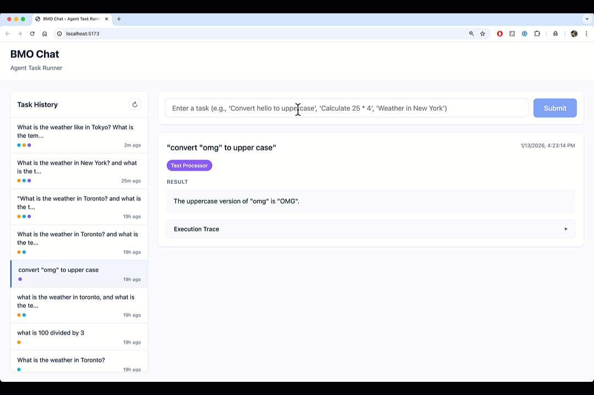

# BMO Chat

A full-stack LangGraph-based agent with streaming.



### Prerequisites

- Node.js 18+
- Python 3.10+
- OpenAI API key

### Setup

```bash
# Clone the repo
git clone <repo-url>
cd bmo-chat

# Install frontend
cd frontend && npm install

# Install backend
cd ../backend
python3 -m venv venv
source venv/bin/activate  # On Windows: venv\Scripts\activate
pip install -e .

# Add your OpenAI API key
echo 'OPENAI_API_KEY=your-key-here' > .env
```

### Running

```bash
# Terminal 1: Start backend
cd backend && source venv/bin/activate && python main.py

# Terminal 2: Start frontend
cd frontend && npm run dev
```

The app will be available at:
- **Frontend**: http://localhost:3000
- **Backend API**: http://localhost:8000
- **API Docs**: http://localhost:8000/docs  

## Project Structure

```
bmo-chat/
├── backend/
│   ├── main.py           # FastAPI server
│   ├── src/
│   │   ├── agent/        # LangGraph agent
│   │   ├── tools/        # Tool implementations
│   │   ├── api/          # REST API routes
│   │   └── persistence/  # SQLite storage
│   └── tests/
└── frontend/
    ├── src/
    │   ├── components/   # React components (TypeScript)
    │   ├── hooks/        # Custom hooks
    │   ├── api/          # API client
    │   └── types/        # TypeScript type definitions
    └── index.html
```

## API Endpoints

| Method | Endpoint | Description |
|--------|----------|-------------|
| POST | `/api/tasks` | Submit task (non-streaming) |
| POST | `/api/tasks/stream` | Submit task (SSE streaming) |
| GET | `/api/tasks` | Get task history |
| GET | `/api/tasks/{id}` | Get specific task |
| DELETE | `/api/tasks/{id}` | Delete task |

## Scripts

```bash
# Frontend (from frontend/)
npm run dev        # Start dev server
npm run build      # Build for production

# Backend (from backend/, with venv activated)
python main.py     # Start server
pytest tests/ -v   # Run tests
```

## Thoughts
The project took about 2 hrs to complete. With more time, I would migrate to PostgreSQL, implement authentication and multi-tenancy.